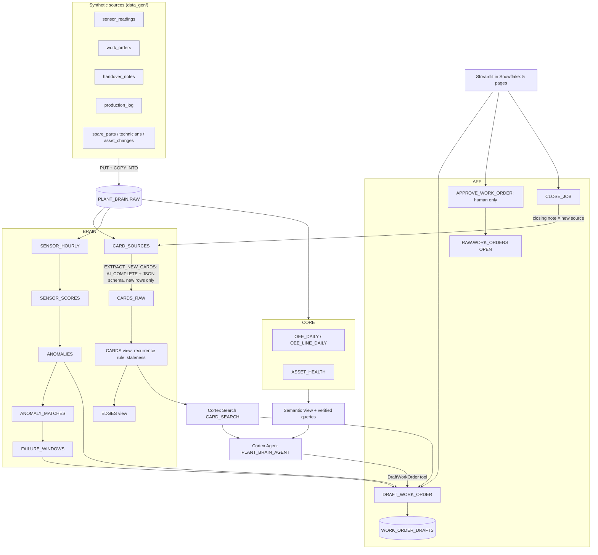

# Architecture

## The learning loop
`CLOSE_JOB` writes the technician's closing note onto the work order and immediately calls
`BRAIN.EXTRACT_NEW_CARDS()`. The extraction log is keyed by `(source, MD5(text))`, so only that one new note is sent
to Cortex. The new card appears in `BRAIN.CARDS` at once, with its edges (e.g. `SUPERSEDES` the fix that didn't hold),
and in Cortex Search after the next refresh.

## One codebase, three runtimes
`app/plant_brain/core.py` holds every read and action. It runs:
1. in **Streamlit in Snowflake** (Snowpark session adapter),
2. inside the **Python stored procedures** (`08_procs.sql` imports the same package from `@APP.CODE`), and
3. **locally** against `mocks/` (DuckDB executes the same portable SQL; Cortex extraction and search are mocked).

All SQL uses `?` placeholders and fully qualified names, so it runs unchanged on Snowflake and DuckDB.

## Design decisions
| Decision | Why |
|---|---|
| **Deterministic z-score + slope** for detection (not ML) | A planner can see *why* it fired (which sensors, how much, ramp vs step), it reproduces exactly for the demo, and it costs nothing to run. `SNOWFLAKE.ML.ANOMALY_DETECTION` is a stretch side-by-side. |
| Residuals vs **hour-of-day profile**, baseline window **24–192 h back** | Removes the daily temperature/load cycle; a slow ramp can't hide inside its own baseline. |
| **Signature matching on the same asset, aligned by age** | "Has this happened before *here*?" is the question. Comparing a 20 h-old anomaly with the first 20 h of past ones avoids rewarding length. |
| **Failure window = range** (past-episode analog vs linear trend) | Honest about uncertainty: history says ~21 h, a straight line says ~54 h. One number would be false precision. |
| **Cards over raw-chunk RAG** | A card has a type, an outcome, an author and an exact excerpt, so answers can be ranked (fixes vs warnings), filtered and cited. Raw chunks can't say "this fix didn't hold". |
| **Recurrence derived by the graph, not the LLM** | The junior's note says "trial run ok". Only the link to the work order 9 days later shows it failed, which is the gotcha. |
| Extraction **once, cached by text hash** | Cost discipline: 439 calls once; each closed job costs one call. |
| **Verified queries** for analytics, generated into the semantic view from one Python list | The same SQL powers Cortex Analyst and the deterministic Ask the Plant route, so numbers are reproducible and cited. |
| **Human approval enforced in code**, and absent from the agent's tools | The agent can draft but never approve; approvals by agent/bot/system names are refused. |
| **Mocks run the real SQL** | Local checks test the Snowflake SQL itself, not a re-implementation. That's how we could verify most of the project before the live account worked. |
