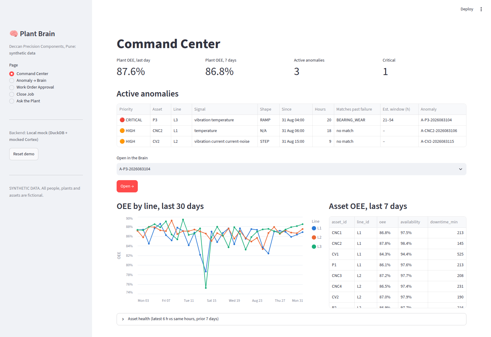
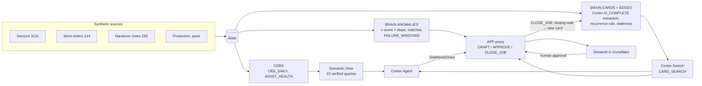

# Plant Brain

> **When your best technician retires, their knowledge doesn't.**

Plant Brain is a maintenance memory for a factory, built on Snowflake for the **Snowflake CoCo CLI Hackathon 2026 –
GCC Edition** (Track 3: Predictive Maintenance & OEE Command Center).
- It turns messy work orders and shift handover notes into cited **knowledge cards**.
- It detects sensor anomalies with explainable SQL, matches them to past failures, and estimates a failure window.
- It drafts a work order with the known fix, the "don't do this" gotchas, parts risk and the right technician.
- A **human approves** the work order. When the job closes, the technician's note becomes new knowledge.

> ⚠️ **SYNTHETIC DATA.** "Deccan Precision Components, Pune", its people, assets and every number are fictional,
> generated by `data_gen/generate.py` (seed=42).

**→ Start here: [`JUMPSTART.md`](JUMPSTART.md)**: local demo in 5 minutes, full Snowflake deploy, demo day.



## Architecture

Details and design decisions: [`ARCHITECTURE.md`](ARCHITECTURE.md).

## Quickstart
```bash
pip install -r requirements.txt
python data_gen/generate.py --verify && python data_gen/generate.py
python -m mocks.warehouse && python scripts/smoke_test.py
PB_BACKEND=mock streamlit run app/streamlit_app.py         # local demo, no account needed
# Snowflake: run snowflake/00_setup.sql in Snowsight (ACCOUNTADMIN), fill .env, then:
python scripts/deploy_snowflake.py
snow streamlit deploy --project app --replace
```

## Repository layout
| Folder | What |
|---|---|
| `app/` | **Core application**: Streamlit UI + `plant_brain/` package (shared by the UI, the Snowflake stored procedures and the mock) |
| `snowflake/` | All Snowflake SQL, `00` → `09`, `99_teardown.sql`, `checks/` |
| `mocks/` | Local stand-ins for Snowflake services (DuckDB runs the same SQL; mocked Cortex extraction + search) |
| `data_gen/` | Seeded synthetic data, golden scenario, `answer_key.json` |
| `eval/` | 25 golden questions, Plant Brain vs naive baseline |
| `scripts/` | Runner, deploy, checks, smoke test, packaging |
| `coco/` | CoCo skills + prompt log |
| `docs/` | Pitch, demo script, data model, evaluation, setup notes |

## Snowflake features used (exact objects)
| Feature | Objects |
|---|---|
| Warehouse, resource monitor, role | `PB_WH` (XS, auto-suspend 60 s), `PB_MONITOR`, `PB_ROLE` |
| Stages + COPY | `RAW.LANDING`, `APP.CODE`, `APP.STREAMLIT_STAGE` |
| SQL views/tables | `CORE.OEE_DAILY`, `CORE.OEE_LINE_DAILY`, `CORE.ASSET_HEALTH`, `BRAIN.SENSOR_HOURLY`, `BRAIN.SENSOR_SCORES`, `BRAIN.ANOMALIES`, `BRAIN.ANOMALY_MATCHES`, `BRAIN.FAILURE_WINDOWS` |
| **Cortex AI SQL** (`AI_COMPLETE`, JSON-schema structured output) | proc `BRAIN.EXTRACT_NEW_CARDS` → `BRAIN.CARDS_RAW` (incremental, cached by text hash); answer writing in Ask the Plant |
| Knowledge graph | views `BRAIN.CARDS` (recurrence rule, staleness), `BRAIN.EDGES` (CONTRADICTS / SUPERSEDES / ABOUT_* / AUTHORED_BY) |
| Tasks | `BRAIN.CARD_EXTRACT_TASK` (hourly backfill, created suspended) |
| **Cortex Search** | `BRAIN.CARD_SEARCH` (filters: asset_id, failure_mode, card_type, outcome) |
| **Semantic View / Cortex Analyst** | `CORE.PLANT_SEMANTIC_VIEW` with 10 verified queries |
| **Python stored procedures** (Snowpark) | `APP.DRAFT_WORK_ORDER`, `APP.APPROVE_WORK_ORDER`, `APP.REJECT_WORK_ORDER`, `APP.CLOSE_JOB`, `APP.RESET_DEMO` |
| **Cortex Agent** | `APP.PLANT_BRAIN_AGENT` (Search + Analyst + procedure tool; no approve tool) |
| **Streamlit in Snowflake** | `APP.PLANT_BRAIN_APP` |

## How CoCo was used
Every phase was driven by prompts logged in [`coco/PROMPTS.md`](coco/PROMPTS.md): what was asked, what was produced,
and what we changed (including the bugs our own checks caught). Two project skills encode the rules the agent
followed: [`card-extractor`](coco/skills/card-extractor/SKILL.md) and [`work-order-drafter`](coco/skills/work-order-drafter/SKILL.md).
[`AGENTS.md`](AGENTS.md) holds the guard rails (synthetic data, GA features, determinism, human approval).

## Evaluation (summary)
25 golden questions (recall, gotcha, analytics, boundary) plus golden-anomaly retrieval, against a naive "keyword search
over raw notes" baseline. **Local mock run (no LLM)**: Plant Brain 25/25 correct and 5/5 correct refusals; baseline
10/25 and 3/5. The first run was 22/25 (three routing/ranking bugs, fixed). Caveats and per-question results are in
[`docs/EVALUATION.md`](docs/EVALUATION.md). Re-run on Cortex with `python eval/run_eval.py --snowflake --write`.

## Limitations
- Synthetic data, and a scenario we designed, so the evaluation proves the mechanism, not generalisation.
- Mock mode replaces the LLM with rules and keyword search; real extraction quality depends on the Cortex model.
- The anomaly detector is deliberately simple (rolling z-score + slope): explainable, but not tuned for production.
- Snowflake-only objects (Cortex proc, search, semantic view, procs, agent, Streamlit deploy) follow current docs
  but have not yet run on a live account; see the verification table in `JUMPSTART.md`.

## Roadmap
Voice-note ingestion (`AI_TRANSCRIBE`), staleness alerts (basic flag already live in `BRAIN.CARDS`), a managed MCP
server exposing the agent to technician apps, and multi-plant card sharing.
