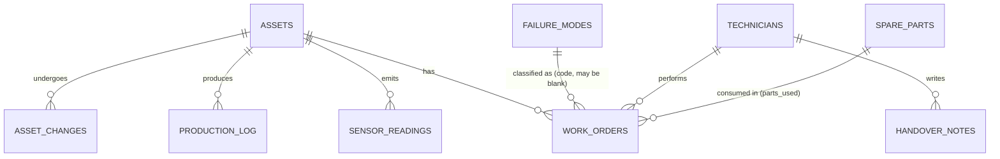

# Data Model

> ⚠️ **SYNTHETIC DATA.** "Deccan Precision Components, Pune", its technicians and assets are fictional. Everything is generated by `data_gen/generate.py` with `seed=42`, using the standard library only, so the output is byte-identical on every run.

- **Time range:** 90 days, `2026-06-03 00:00` → `2026-08-31 23:55` (day 0 … day 89). Timestamps are plant local time (IST), stored as `TIMESTAMP_NTZ`.
- **Shifts:** A 06:00–14:00, B 14:00–22:00, C 22:00–06:00. Shift C belongs to the `shift_date` on which it starts.
- **Regenerate:** `python data_gen/generate.py` writes `data_gen/out/*.csv` (gitignored, ~14 MB) and `data_gen/answer_key.json` (committed).
- **Check:** `python data_gen/generate.py --verify` asserts every invariant below and exits non-zero on any failure.

## Entity overview



## Tables (RAW schema)

| Table | Rows | Grain | Key columns |
|---|---|---|---|
| `assets` | 12 | asset | `asset_id`, `asset_name`, `asset_type`, `line_id` (L1–L3), `install_date`, `firmware_version`, `model`, `ideal_cycle_time_s` (blank for compressors), `criticality` |
| `sensor_readings` | 311,040 | asset × 5 min | `asset_id`, `ts`, `vibration_rms` (mm/s), `temperature_c`, `pressure_bar` (presses and compressors only, otherwise NULL), `current_a` |
| `failure_modes` | 10 | failure mode | `failure_mode_id`, `code`, `name`, `applicable_asset_types` (pipe-separated), `primary_sensors`, `signature_description`, `threshold_rule`, `typical_precursor_h` |
| `technicians` | 8 | person | `technician_id`, `full_name`, `seniority`, `years_experience`, `skills` (asset types), `shift_pattern`, `retiring_2027` |
| `work_orders` | 144 | work order | `wo_id`, `asset_id`, `wo_type` (CORRECTIVE / PREVENTIVE / INSPECTION), `priority`, `failure_mode_code` (blank on ~12% of correctives), `reported_at`, `started_at`, `closed_at`, `downtime_min`, `technician_id`, `parts_used` (`PART:qty;PART:qty`), `resolution_note` (messy free text), `status` |
| `handover_notes` | 295 | note | `note_id`, `created_at`, `shift_date`, `shift`, `note_type` (SHIFT / ADHOC), `line_id`, `author_technician_id`, `note_text` |
| `production_log` | 2,690 | production asset × shift | `asset_id`, `line_id`, `shift_date`, `shift`, `planned_time_min`, `run_time_min`, `downtime_min`, `ideal_cycle_time_s`, `total_count`, `good_count` |
| `spare_parts` | 40 | part | `part_id`, `description`, `asset_types`, `stock_qty`, `reorder_point`, `lead_time_days`, `unit_cost_inr` |
| `asset_changes` | 15 | change event | `change_id`, `asset_id`, `changed_at`, `change_type` (PART_REPLACEMENT / FIRMWARE_UPDATE / LUBRICANT_CHANGE), `description` |

### Assets

| Line | Assets |
|---|---|
| L1 | CNC1, CNC2, P1, AC1, CV1 |
| L2 | CNC3, CNC4, P2, CV2 |
| L3 | P3, AC2, CV3 |

The 4 CNC mills, 3 hydraulic presses and 3 conveyors are production assets and appear in `production_log`. The 2 air compressors are utilities: they have sensors and work orders but no OEE.

### Technicians

| ID | Name | Seniority | Skills | Retiring 2027 |
|---|---|---|---|---|
| T01 | Ravi Kulkarni | Senior (31 y) | Press, compressor | **Yes** |
| T02 | Suresh Patil | Senior (28 y) | Conveyor, press | **Yes** |
| T03 | Meena Joshi | Mid | CNC, compressor | |
| T04 | Arjun Deshmukh | Junior (2 y) | Press, conveyor | |
| T05 | Farhan Shaikh | Mid | CNC | |
| T06 | Priya Nair | Mid | Conveyor, compressor | |
| T07 | Vikram Rao | Mid | CNC, press | |
| T08 | Sneha Gaikwad | Junior (1 y) | CNC, conveyor | |

Anjali (the planner persona) is not a technician. She only appears by name inside notes.

### Failure modes and sensor signatures

| Code | Applies to | Signature |
|---|---|---|
| BEARING_WEAR | all types (history only on P3 for presses) | Vibration ramps +18% over 36 h, temperature follows after a 12 h lag, then both accelerate to +35% / +15 °C at ~48 h |
| SEAL_LEAK | press | Pressure −8% over 24 h, current +4% |
| SPINDLE_MISALIGNMENT | CNC | Vibration step +20%, then creeps; current +5% |
| BELT_SLIP | conveyor | Vibration step +22%, current noise ×4, temperature flat |
| VALVE_STICKING | press, compressor | Pressure noise grows ×5 over 12 h |
| COOLANT_BLOCKAGE | CNC | Temperature +10 °C over 16 h, vibration flat |
| MOTOR_OVERHEAT | conveyor, compressor | Temperature +12 °C and current +8% over 18 h |
| AIR_FILTER_CLOG | compressor | Pressure −6%, current +6% over 48 h |
| TOOL_WEAR | CNC | Current +8%, vibration +5% over 24 h |
| OIL_CONTAMINATION | press | Temperature +6 °C over 48 h, pressure noise ×2 |

### Sensor model
- **Baseline:** each asset type has a nominal baseline, and each asset gets its own ±5% offset.
- **Daily cycle:** ambient temperature varies ±2.5 °C (peak mid-afternoon) and load ±3%.
- **Day-to-day:** each day gets a small level offset (σ 0.5%).
- **Noise:** Gaussian. σ is 2% of baseline for vibration, 0.4 °C for temperature, 0.8% for pressure and 1.5% for current.
- **Downtime:** while a work order has the machine down, readings drop to idle levels (vibration ~12%, current ~6%, pressure ~5% of baseline).
- **Background breakdowns:** 50 corrective events. 80% of them inject their failure-mode signature before `reported_at`; the other 20% are sudden failures with no precursor.

### Production log and OEE
- `planned_time_min` = 450 (480-minute shift minus a 30-minute break), minus any overlapping preventive maintenance or inspection time.
- `run_time_min` = planned time minus overlapping corrective downtime, minus 0–20 minutes of random minor stops.
- `total_count` = ⌊run × 60 / ideal_cycle_s × performance⌋, where performance is drawn from U(0.86, 0.96).
- `good_count` = round(total × quality), where quality is drawn from U(0.965, 0.995).
- The final C shift, which runs past the end of the data, is excluded.

**OEE (per asset per `shift_date`), which `CORE.OEE_DAILY` must reproduce:**

```
Availability = Σ run_time_min / Σ planned_time_min
Performance  = Σ (ideal_cycle_time_s × total_count) / (Σ run_time_min × 60)
Quality      = Σ good_count / Σ total_count
OEE          = Availability × Performance × Quality
```

### Messy text
Resolution notes and handover notes are built from templates, then roughened:
- Abbreviations (brg, vib, chngd, prodn, pls)
- ~4% adjacent-letter typos
- Random lowercasing
- Hinglish tails ("theek hai", "kal dekhte hain")
- Casual problem labels ("oil looks milky", "motor tripping")

Golden and gotcha text is hand-written in `scenario.py` and is never roughened, so the answer-key excerpts stay exact.

## Golden scenario (`data_gen/scenario.py`)

| Key | Work order | Precursor onset → reported | Tech | Fix | Outcome |
|---|---|---|---|---|---|
| E1 | WO-2026-0021 | 06-15 06:00 → 06-17 06:00 | Ravi (T01) | bearing 6312 **+ HT-3 grease** | RESOLVED |
| J1 | WO-2026-0067 | 07-11 10:00 → 07-13 10:00 | Arjun (T04) | bearing only | **RECURRED** 9 days later |
| E2 | WO-2026-0079 | 07-20 13:00 → 07-22 13:00 | Ravi (T01) | bearing + HT-3, old grease flushed | RESOLVED |
| E3 | WO-2026-0116 | 08-12 20:00 → 08-14 20:00 | Ravi (T01) | bearing + HT-3 | RESOLVED |
| **LIVE** | — | **08-31 00:00 →** (ongoing) | — | — | demo moment |

- **The clear note:** written in exactly one handover note, `HN-0160` (07-22, shift B, by Ravi) and buried in chatter: *"…Fix = replace bearing AND switch grease from LG-2 to HT-3 high-temp grade… Only bearing change does NOT hold…"*.
- **Fragments** appear in 4 other notes, e.g. *"Ravi bol raha tha lube change karo warna phir se aayega"*, and in the work-order notes.
- **The J1 note says "trial run ok".** Its `RECURRED` outcome can only be derived by linking it to E2, which is a same-asset, same-failure-mode recurrence within 14 days. That link is what the knowledge graph is for.
- **Decoys (final day):**
  - D1: CNC2 coolant blockage. Temperature rises while vibration stays flat.
  - D2: CV2 belt slip. Vibration **steps** up instead of ramping, current is erratic, temperature is flat.
  - Neither may match P3's bearing history.
- **Quiet period:** no other asset has events in the final 3 days, so the Command Center shows exactly 3 active anomalies.
- **Other buried tribal knowledge** (5 notes, with expected cards C8–C12):
  - CV1: belt over-tension trips the motor.
  - AC2: drain the sticking valve manually every shift start.
  - CNC3: home the axes after a power cut.
  - P1: use the viton seal kit.
  - CNC1: warmup required on firmware v4.2.
- **Staleness hooks** in `asset_changes`:
  - The AC2 drain valve was replaced on day 77, which makes the day-31 AC2 gotcha stale.
  - CNC1 firmware v4.2 arrived on day 62, which introduced the CNC1 warmup convention.
- **Parts drama:** `BRG-6312` and `LUB-HT3` each have stock 1, reorder point 2 and 21 / 10 day lead times. Both are at risk of stockout.

## `answer_key.json`
Generated alongside the data (never edit it by hand). It contains:
- `expected_cards`: C1–C12, each with type, asset, failure mode, outcome, author, source id and an exact `excerpt_contains` substring.
- `expected_edges`: C6 → C5 `CONTRADICTS` and C1 → C5 `SUPERSEDES`.
- `golden_anomaly`:
  - onset and signature (+12% vibration at end of data, 0.5 %/h slope, 12 h temperature lag)
  - the 4 historical P3 precursor windows
  - failure window (analog ≈ 24 h, linear extrapolation ≈ 46 h)
  - expected top-3 retrieval (`HN-0160`, `WO-2026-0079`, `WO-2026-0067`) and the hit@3 rule
  - recommended technician T01 and required parts
- `decoys`: both with `should_match_p3_bearing = false`.
- `expected_oee`:

| Asset | Date | A | P | Q | OEE |
|---|---|---|---|---|---|
| P3 | 2026-06-17 (E1 breakdown) | 0.6985 | 0.9083 | 0.9872 | 0.6264 |
| CNC1 | 2026-07-03 (normal) | 0.9881 | 0.9199 | 0.9729 | 0.8843 |
| CV2 | 2026-08-31 (final day, 2 shifts) | 0.9778 | 0.9015 | 0.9702 | 0.8552 |

## Invariants asserted by `--verify`
1. Row counts: 12 assets, 8 technicians (2 retiring), 10 failure modes, 311,040 readings, and roughly 150 work orders, 300 notes, 40 parts and 15 changes.
2. Exactly 4 P3 BEARING_WEAR work orders:
   - 3 by Ravi, each with BRG-6312 + LUB-HT3
   - 1 bearing-only by Arjun
   - E2 reported exactly 9 days after J1 closed
   - no bearing history on P1/P2
3. Each historical P3 precursor shows vibration +18% ±3% at 36 h and temperature roughly flat at 6 h but +6 to +10 °C at 36 h (compared against the same clock time before onset).
4. LIVE shows +9 to +15% vibration and +2 to +6 °C after ~24 h on the final day.
5. D1 has +7 °C or more with flat vibration. D2 has a vibration step with flat temperature and erratic current.
6. No other asset drifts in the final 3 days.
7. The clear fix phrase appears in exactly one note. The fix also appears in fragments in 3 or more other notes, and each gotcha is buried exactly once.
8. The OEE values in the answer key recompute from `production_log`, and P3's availability dips below 80% on the E1 day.
9. Regenerating in memory is byte-identical, and the committed `answer_key.json` matches.
