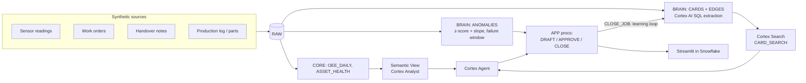

# Plant Brain — Pitch Outline (7 slides)

> **"When your best technician retires, their knowledge doesn't."**
> Snowflake CoCo CLI Hackathon 2026 – GCC Edition · Track 3: Predictive Maintenance & OEE Command Center

All companies, people, plants, assets and figures below are **fictional / illustrative**. Everything runs on synthetic data.

---

## Slide 1 — The problem

**On the slide**
- Unplanned downtime is the most expensive minute in a factory.
- Sensor data can tell you *that* a machine is drifting. It can't tell you *what fixed it last time*.
- That knowledge lives in the heads of senior technicians, plus scribbled work-order notes and shift handovers nobody searches.
- *Illustrative:* a mid-size plant with 12 critical assets and ~40 unplanned stops a year at ~₹2.5 lakh per stop ≈ **₹1 crore/year** in lost output. Repeat failures, where the "right" fix was known but not applied, make up a meaningful share of that. *(Figures are illustrative, not sourced.)*

**Speaker notes**
> "Every plant has a dashboard that turns red. Very few have a system that says what to do about it. The answer usually exists. It's in Ravi's head, and Ravi retires next year. The problem statement says OT data sits apart from ERP and maintenance context. We think the missing context is tribal knowledge."

---

## Slide 2 — The persona

**On the slide**
- **Anjali**, maintenance planner, *Deccan Precision Components, Pune* (fictional).
- 3 lines · 12 critical assets · 8 technicians.
- **2 of the 8 technicians retire in 2027**, including Ravi K., the person everyone calls when Press P3 acts up.
- Her day: triage alarms, dig through old work orders, phone senior techs, write work orders, chase parts.

**Speaker notes**
> "Anjali doesn't need another chart. She needs to know, in the moment an alarm fires: has this happened before, what fixed it, what *didn't* fix it, do we have the part, and who should go. Today that takes phone calls and luck. After 2027 it may not be possible at all."

---

## Slide 3 — The insight

**On the slide**
- **Sensor data + tribal knowledge + action.**
- Most "chat with your data" tools stop at answering questions.
- Plant Brain closes the loop. It detects the drift, recalls how it was fixed before, warns what didn't work, drafts the work order, and waits for a human to approve.
- Knowledge is captured **passively** from work orders and handover notes people already write. There's no new form to fill in.

**Speaker notes**
> "Three ingredients that usually live in three systems. The sensors say something is wrong. The notes say what worked. The work order is the action. We put all three in one place, Snowflake, and connect them. And we don't ask technicians to do anything new: they keep writing messy notes, Hinglish and typos included, and the Brain turns those into structured knowledge cards."

---

## Slide 4 — The product: the learning loop

**On the slide**

```
 Sensor anomaly ──► Brain recall ──► Failure window ──► Drafted work order
      ▲            (cards + gotchas)   (est. range)     (citations, parts, tech)
      │                                                        │
      │                                                        ▼
 New knowledge card ◄── Closing note ◄── Job done ◄── Human approval
```

1. **Anomaly:** P3 vibration +18% over ~36h, temperature starting to follow.
2. **Recall:** 3 matching past episodes. Ravi's fix was bearing **plus** lubricant grade change.
3. **Gotcha:** a bearing-only fix recurred 9 days later. Don't repeat it.
4. **Failure window:** estimated time-to-threshold, shown with a low/high range and labeled as an estimate.
5. **Draft work order:** cites card IDs, checks spare-part stock, proposes the technician who has fixed it before.
6. **Human approves.** The agent never approves anything on its own.
7. **Close the job.** The closing note becomes a new card, so the Brain gets smarter with every job.

**Speaker notes**
> "This is the whole product in one loop. The step judges should watch is the last one: when the technician closes the job, their note flows back into the Brain as a new card. That's how Ravi's knowledge outlives Ravi's employment."

---

## Slide 5 — The architecture (all Snowflake)

**On the slide** (final diagram lives in `ARCHITECTURE.md`)



- Cortex AI SQL builds knowledge cards from messy text, incrementally.
- Plain, deterministic SQL does anomaly detection and failure-window estimates, so they can be explained and reproduced.
- Cortex Search + Semantic View + Cortex Agent handle recall, analytics, and orchestration.
- Streamlit in Snowflake is the UI. No data leaves the account.
- Built with **CoCo CLI**, using custom skills for card extraction and work-order drafting (see `coco/PROMPTS.md`).

**Speaker notes**
> "One platform, no glue servers. Governance, cost controls and data residency are the same as for the rest of your Snowflake estate. We chose a deterministic z-score over a black-box model for detection, so a planner can see *why* the alarm fired."

---

## Slide 6 — The proof: evaluation

**On the slide** *(from `docs/EVALUATION.md`, **live on Snowflake Cortex**)*

| Metric | Naive baseline (keyword RAG over raw notes) | Plant Brain |
|---|---|---|
| Retrieval hit@3 on golden anomaly | 1/1 | 1/1 |
| Answer correctness (25 golden Qs) | 9/25 (36%) | 18/25 (72%) |
| Analytics answers correct (7) | 1/7 | 7/7 |
| Correct refusals on boundary Qs (5) | 3/5 | 5/5 |
| Answers with citations (20 answerable) | 18/20 | 13/20 |

- All 7 misses are over-cautious answers (the cards were retrieved). The offline mock run (no LLM) is 25/25 vs 10/25.

**Speaker notes**
> "We didn't just demo the happy path. We built 25 golden questions with an answer key and ran the same questions against a naive baseline. Here's where the Brain wins, and here's where it still gets things wrong."

---

## Slide 7 — Roadmap and impact

**On the slide**
- **Voice notes:** technicians talk and the Brain listens (`AI_TRANSCRIBE`, where available).
- **Staleness alerts:** a card is flagged when the asset it describes has changed (new firmware, replaced part).
- **MCP server:** expose the agent to technician mobile apps and other copilots.
- **Multi-plant rollout:** share knowledge cards across sister plants running the same equipment.
- *Illustrative impact:* fewer repeat failures, faster MTTR, and a knowledge base that survives retirements.

**Speaker notes**
> "Every closed job makes the Brain better, and nobody has to write documentation. Next come voice, staleness, and taking it to the technician's phone. When your best technician retires, their knowledge doesn't. Thank you."
